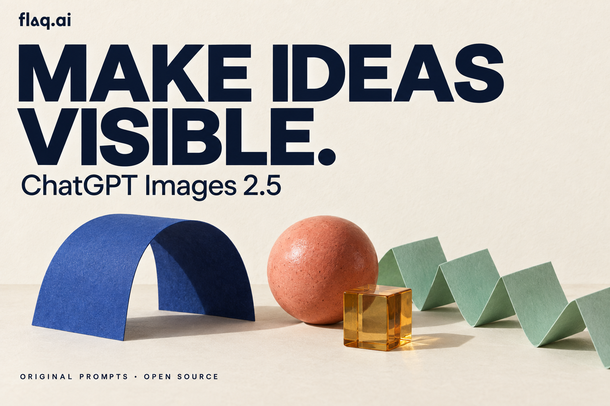

# Prompts para ChatGPT Images 2.5 — flaq.ai

Projeto independente de código aberto criado e mantido pela equipe da [flaq.ai](https://flaq.ai), com aplicações em fotografia de produtos, edição localizada, retratos, anúncios, infográficos e storyboards.

[English](README.md) · [简体中文](README_zh.md) · [繁體中文](README_tw.md) · [日本語](README_ja.md) · [한국어](README_ko.md) · [Español](README_es.md) · [Français](README_fr.md) · [Deutsch](README_de.md) · **Português (Brasil)** · [Italiano](README_it.md) · [Русский](README_ru.md) · [العربية](README_ar.md) · [हिन्दी](README_hi.md) · [ไทย](README_th.md) · [Bahasa Indonesia](README_id.md) · [Tiếng Việt](README_vi.md)



São 97 receitas em 14 conjuntos e 28 imagens geradas para o projeto: 73 receitas completas em inglês e chinês simplificado, mais 12 receitas específicas por idioma. Há 16 versões do README por idioma ou região. Esta introdução em português do Brasil não é uma tradução de toda a biblioteca. Há também 12 novas receitas de fluxo de trabalho disponíveis apenas em inglês.

## Como começar

Escolha uma receita no [índice](prompts/README.md). Para editar, envie as imagens de referência indicadas e separe o que deve mudar do que precisa ser preservado. Revise o resultado e use a imagem aprovada como entrada da próxima edição.

## Experimente em português

[↗ L008](prompts/11-multilingual.md#l008)

```text
Crie um cartaz vertical 2:3 para uma padaria fictícia. Mostre um pão redondo cortado sobre um pano de linho azul, em fundo creme com luz suave da manhã. A crosta deve ter textura natural, sem brilho plástico. Escreva exatamente "PÃO, TEMPO E AFETO" no alto, "Feito para compartilhar" abaixo e "PADARIA DA ESQUINA" no rodapé. Preserve o til de PÃO, mantenha margens largas e não acrescente preços, selos ou endereços. Na revisão, altere apenas o pano para verde-oliva; mantenha o pão, a iluminação e todas as palavras.
```

Conferir PÃO, a vírgula, as três linhas de texto e a textura do pão.

## Estado dos exemplos

O prompt abaixo é um modelo ainda sem imagem gerada. As imagens do projeto foram criadas com a ferramenta integrada do Codex, que não informou o identificador do modelo. Elas não são uma comparação verificada de Flare e Sunburst. Confira textos, quantidades e formas antes de publicar.

## Sobre a flaq.ai

A [flaq.ai](https://flaq.ai) oferece uma API unificada para modelos de imagem, vídeo, música e linguagem, voltada a quem desenvolve agentes de IA e aplicativos. A equipe publica esta biblioteca para compartilhar processos criativos como prompts reutilizáveis, acompanhados de observações sobre os resultados.

Os links da Flaq.ai abaixo são para GPT Image 2. Para usar Images 2.5 diretamente na OpenAI, consulte o [guia de API](docs/api-guide.md).

[GPT Image 2 API](https://flaq.ai/models/openai/gpt-image-2/) · [GPT Image 2 Edit API](https://flaq.ai/models/openai/gpt-image-2-edit/) · [API docs](https://flaq.ai/docs/) · [Model market](https://flaq.ai/model-market/) · [Affiliate program](https://flaq.ai/affiliate-program/)

## Recursos e contribuições

[97 prompts](prompts/README.md) · [Before / after](docs/launch-examples.md) · [Generation log](docs/generation-log.md) · [OpenAI API guide](docs/api-guide.md) · [Contributing](CONTRIBUTING.md)

Este projeto não é afiliado à OpenAI nem recebe seu endosso. [MIT License](LICENSE) © 2026 Flaq AI.
