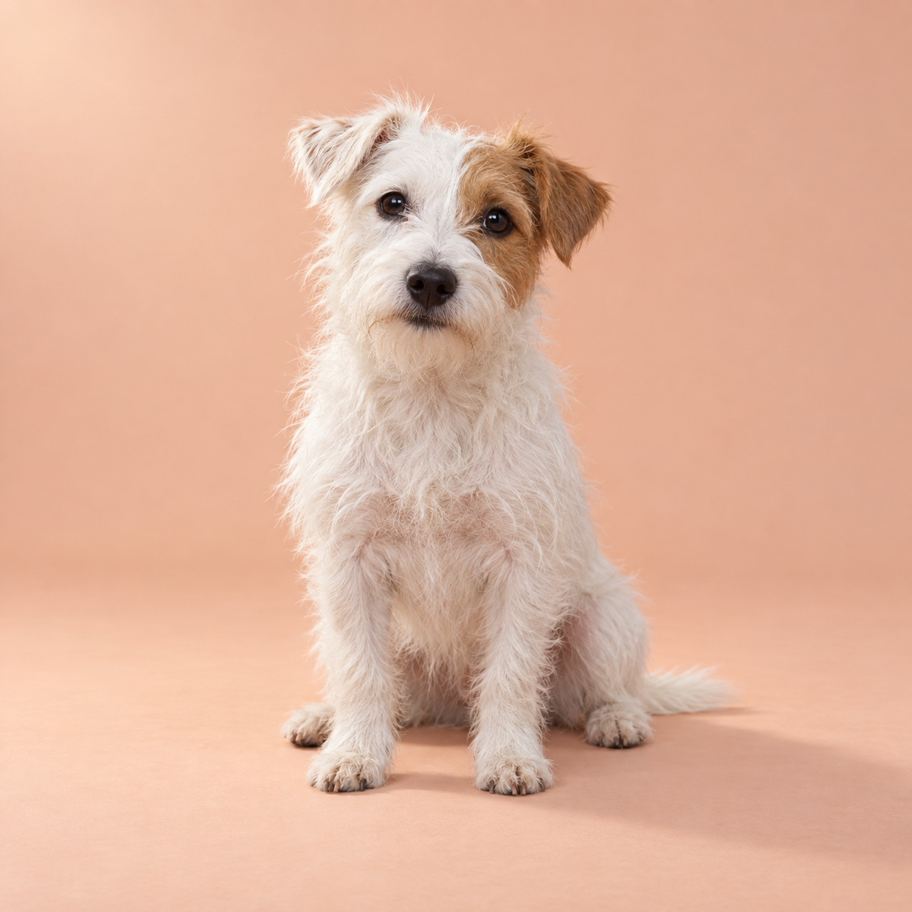
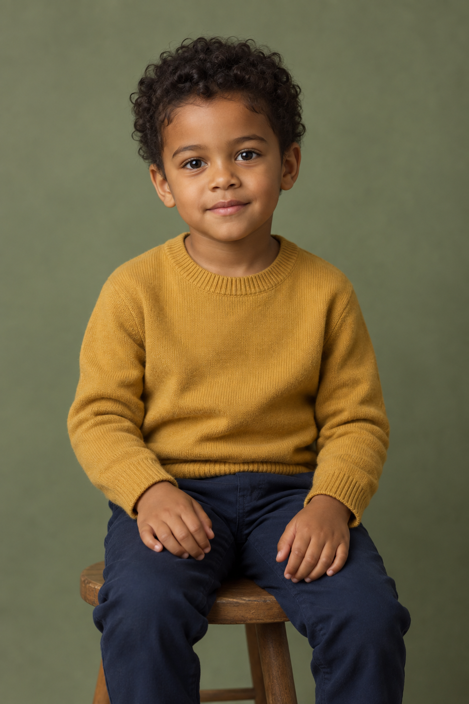
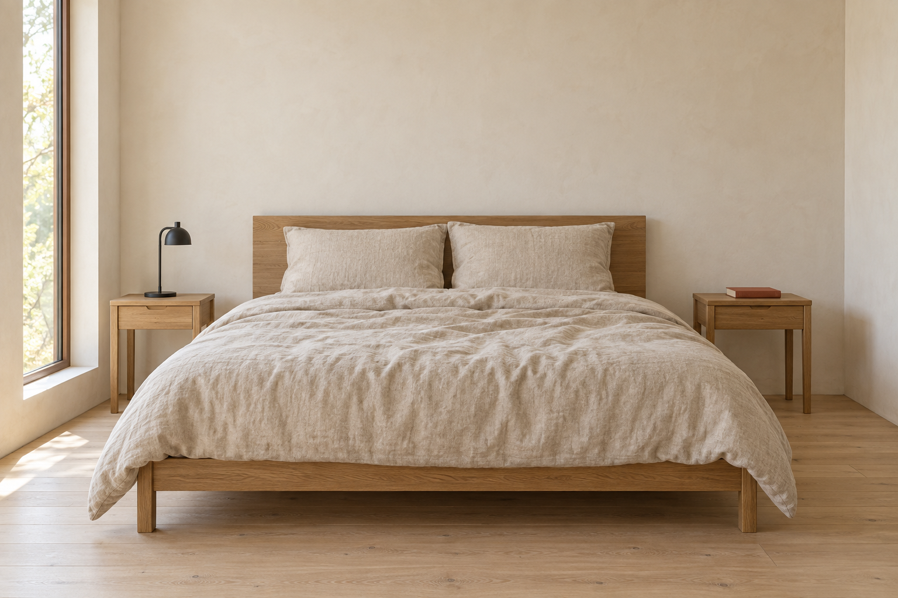
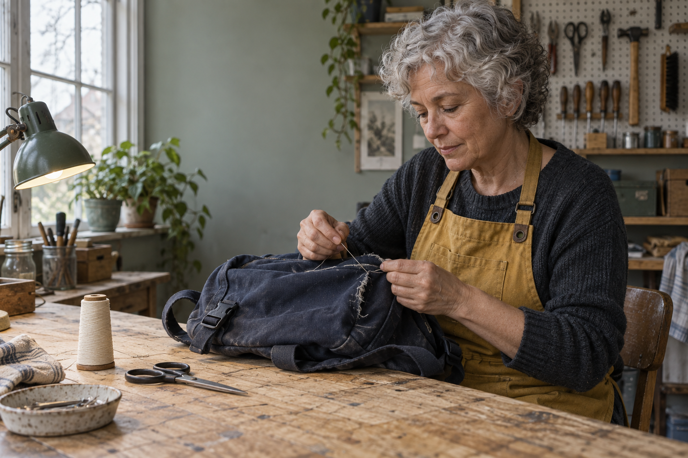
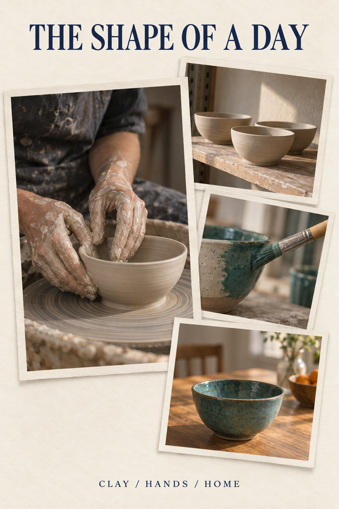

# Generation log · 图片生成记录

28 original images were generated with the Codex built-in image tool: 21 on **2026-09-09**, then six new studio scenes and one roof-color edit on **2026-09-11**. No external reference images were supplied; all edits use earlier outputs from this repository.

工具未返回底层模型ID、质量设置或种子，不补写推断值。这28张图保留原始PNG；每个文件记录真实执行提示词、输入关系和人工目测结果。不可将这些图片视为Flare或Sunburst的已验证评测。

Exact prompts and inputs enable another attempt, not deterministic reproduction. Reusable recipes can differ from the executed prompt. Follow-up suggestions are unrendered unless a separate output is logged.

## Library cover

- Recipe: `COVER`
- Dimensions: 1536 × 1024
- [Exact executed prompt](../assets/generation/cover.txt)
- SHA-256: `a1675f613b32c913a91332271cf11df4c4f6d0bc942eea28f97525719aae8774`
- Inputs: None / 无

**Review:** Typography and objects visually reviewed; generated brand treatment is not an official logo file.

## Original campaign

- Recipe: `P001`
- Dimensions: 1536 × 1024
- [Exact executed prompt](../assets/generation/tideline-lamp.txt)
- SHA-256: `6aeb821e89f195162fef5f0cbd32ff6aa6ba3d5cbbdb339ad545631d957edfbb`
- Inputs: None / 无

**Review:** Headline and brand are readable. Material appearance is illustrative; recycled content cannot be verified visually.

## Edit 1: base color

- Recipe: `P019`
- Dimensions: 1536 × 1024
- [Exact executed prompt](../assets/generation/tideline-lamp-jade.txt)
- SHA-256: `2843ef853af6a2639c4aedb33eb9643b3cb7bb25b758cef13caa8ab4a04333e2`
- Inputs: [tideline-lamp.png](../assets/images/tideline-lamp.png)

**Review:** Base becomes green. Main composition retained. The narrow stem also shifts green, slightly outside the requested cylindrical-base region.

## Edit 2: headline

- Recipe: `P019`
- Dimensions: 1536 × 1024
- [Exact executed prompt](../assets/generation/tideline-lamp-copy.txt)
- SHA-256: `0aea19cb8f40be596e9ceca8ef098917e3f2d358061b2c2e3ab496d27e941832`
- Inputs: [tideline-lamp-jade.png](../assets/images/tideline-lamp-jade.png)

**Review:** New headline and retained green base visually verified. Fine texture and highlights drift; not a pixel-identical edit.

## Japanese bakery poster

- Recipe: `L003`
- Dimensions: 1024 × 1536
- [Exact executed prompt](../assets/generation/komorebi-bakery.txt)
- SHA-256: `e32844e8900fe27c92625e63b1941dde8dcc0f601aebc9e76f8dbca2ed4cd62e`
- Inputs: None / 无

**Review:** Three requested text strings visually match. Portrait is 2:3. Native editorial review remains recommended.

## Wordless storyboard

- Recipe: `P037`
- Dimensions: 1536 × 1024
- [Exact executed prompt](../assets/generation/paper-moon-story.txt)
- SHA-256: `e05d17c13228662d74257847ebd824eed78081a7137de8943d6add0a4b2f00ed`
- Inputs: None / 无

**Review:** Six panels and recognizable robot retained. Panel three shows stitches before the dedicated stitching panel; medium is more dimensional than requested. Teaching example requiring continuity revision.

## Reading-room concept

- Recipe: `P043`
- Dimensions: 1536 × 1024
- [Exact executed prompt](../assets/generation/reading-room.txt)
- SHA-256: `050679d6aba9ef04df2fcbe97c237e50643ade6bffbb018482bd8f27ef7620a7`
- Inputs: None / 无

**Review:** Main arrangement and four chairs visible. Added cup/vase and illegible book-spine marks; circulation and construction not validated.

## Terrier cape makeover — input

- Recipe: `P061`
- Dimensions: 1254 × 1254
- [Exact executed prompt](../assets/generation/launch-dog-input.txt)
- SHA-256: `a58f4c8d7151a23ea081b669284e2474e9c8b5a9cd68b6db33baad73335088ac`
- Inputs: None / 无

**Review:** Newly generated fictional input; no official example image was supplied. Inspect this input before editing.

## Terrier cape makeover — edit

- Recipe: `P061`
- Dimensions: 1254 × 1254
- [Exact executed prompt](../assets/generation/launch-dog-edit.txt)
- SHA-256: `416e047e608211d21a421ee906fb47904d90e6a86545abbd3f2f03e2ec980db5`
- Inputs: [launch-dog-input.png](../assets/images/launch-dog-input.png)

**Review:** Green cape and tie added; eye patch, ears and paws remain recognizable. Fine fur detail changes.

## Synthetic child portrait wardrobe edit — input

- Recipe: `P062`
- Dimensions: 1024 × 1536
- [Exact executed prompt](../assets/generation/launch-child-input.txt)
- SHA-256: `c783863a49c5ca2cf65dd65746437dd86a599e5b91997f2c7e8e0d25f1ce241b`
- Inputs: None / 无

**Review:** Newly generated fictional input; no official example image was supplied. The child is fully synthetic.

## Synthetic child portrait wardrobe edit — edit

- Recipe: `P062`
- Dimensions: 1024 × 1536
- [Exact executed prompt](../assets/generation/launch-child-edit.txt)
- SHA-256: `8e5b4ef923f98b0560f268a70dd7c19aa3c1611ff3efcd49ffc1ffa03283c84c`
- Inputs: [launch-child-input.png](../assets/images/launch-child-input.png)

**Review:** Cardigan and cream shirt appear as requested; face, hands and pose remain visually similar. Fine texture is not identical. Subject is fully synthetic.

## Duvet pattern swap — input

- Recipe: `P063`
- Dimensions: 1536 × 1024
- [Exact executed prompt](../assets/generation/launch-bed-input.txt)
- SHA-256: `d8a6afb258a81239a3de3eefeb5f3baee73789599bf8b9e385f95a0923875ba5`
- Inputs: None / 无

**Review:** Newly generated fictional input; no official example image was supplied. Inspect this input before editing.

## Duvet pattern swap — edit

- Recipe: `P063`
- Dimensions: 1536 × 1024
- [Exact executed prompt](../assets/generation/launch-bed-edit.txt)
- SHA-256: `f2e253f57da09c5de0cd3186acc13745472a558dc83dfd1466e8ea1f8d7d4ac4`
- Inputs: [launch-bed-input.png](../assets/images/launch-bed-input.png)

**Review:** Striped duvet and two oatmeal pillows are present; room arrangement remains similar. Duvet folds drift slightly.

## Souvenir city-name replacement — input

- Recipe: `P064`
- Dimensions: 1536 × 1024
- [Exact executed prompt](../assets/generation/launch-ticket-input.txt)
- SHA-256: `04b59634b3119c0a383e989b67153fb9c074729cbb27cdf81c16bcd0cc9e045e`
- Inputs: None / 无

**Review:** Newly generated fictional input; no official example image was supplied. Inspect this input before editing.

## Souvenir city-name replacement — edit

- Recipe: `P064`
- Dimensions: 1536 × 1024
- [Exact executed prompt](../assets/generation/launch-ticket-edit.txt)
- SHA-256: `b9635545ed47cac69bf8920472877f76adb495b271d4ce89d093421ec1b9bfa4`
- Inputs: [launch-ticket-input.png](../assets/images/launch-ticket-input.png)

**Review:** LISBON and the other required strings visually match. Illustration details drift slightly. This is a fictional souvenir, not a valid ticket.

## Symbol-marked cube rotation — input

- Recipe: `P065`
- Dimensions: 1254 × 1254
- [Exact executed prompt](../assets/generation/launch-cube-input.txt)
- SHA-256: `7b29e4516720b4888cc2de57849b7eca9bbcdd4d482ae99476f28b661e8ab805`
- Inputs: None / 无

**Review:** Newly generated fictional input; no official example image was supplied. Inspect this input before editing.

## Symbol-marked cube rotation — edit

- Recipe: `P065`
- Dimensions: 1254 × 1254
- [Exact executed prompt](../assets/generation/launch-cube-edit.txt)
- SHA-256: `13f8b4e05e5d7bd7ea729d2f01a07d25e4e407249ed0cd759aabc5f6738f52a2`
- Inputs: [launch-cube-input.png](../assets/images/launch-cube-input.png)

**Review:** Partial result: face identities follow the intended arrangement, but a rigid 90-degree rotation is not established. The top outline has a visible kink. Do not use as validated geometry.

## One-column itinerary revision — input

- Recipe: `P066`
- Dimensions: 1536 × 1024
- [Exact executed prompt](../assets/generation/launch-travel-input.txt)
- SHA-256: `aaa761b7c96a972fde34795ffbed0d4969145cf4e1bac70e91d3e3daa15fcd5e`
- Inputs: None / 无

**Review:** Newly generated fictional input; no official example image was supplied. Inspect this input before editing.

## One-column itinerary revision — edit

- Recipe: `P066`
- Dimensions: 1536 × 1024
- [Exact executed prompt](../assets/generation/launch-travel-edit.txt)
- SHA-256: `8b1f2b6589d2b23b1321edd93ec789cb1056e6f10de010a0e21554c069f9e4a1`
- Inputs: [launch-travel-input.png](../assets/images/launch-travel-input.png)

**Review:** Middle time and heading match; three bowls appear on the workbench. Extra vessels appear on the shelf. Outer columns remain recognizable but fine illustration details drift.

## Birthday candle count edit — input

- Recipe: `P067`
- Dimensions: 1254 × 1254
- [Exact executed prompt](../assets/generation/launch-cake-input.txt)
- SHA-256: `3ccfe58184f73c8ececee50b4bd1f9228f93eaf679de826813b441a8ba5244d2`
- Inputs: None / 无

**Review:** Newly generated fictional input; no official example image was supplied. Inspect this input before editing.

## Birthday candle count edit — edit

- Recipe: `P067`
- Dimensions: 1254 × 1254
- [Exact executed prompt](../assets/generation/launch-cake-edit.txt)
- SHA-256: `24d7c809a3ada4a0816001a38ce7a0fe949e1b81fc9d54969f0e267b8327b5e0`
- Inputs: [launch-cake-input.png](../assets/images/launch-cake-input.png)

**Review:** Exactly five unlit orange candles are visible. Cake, plate and composition are similar; frosting texture changes slightly.

## Repair collective editorial portrait — original generation

- Recipe: `P068`
- Created: 2026-09-11
- Dimensions: 1536 × 1024
- [Exact executed prompt](../assets/generation/studio-workshop.txt)
- SHA-256: `090fcb276915dbd1bda075e6ce777a6b2f24d83c0078d966444a60de363a4c73`
- Inputs: None / 无

**Review:** Subject, backpack seam and window light match the brief. Extra bowl and cloth appear on the foreground workbench; fingers and needle contact need close production review.

## Four-step pour-over poster — original generation

- Recipe: `P069`
- Created: 2026-09-11
- Dimensions: 1536 × 1024
- [Exact executed prompt](../assets/generation/studio-brew.txt)
- SHA-256: `0b6043327aca4771971569614f56deb6de64ca123c6a51019722b9da56b5281c`
- Inputs: None / 无

**Review:** Four ordered columns and all requested labels are present. Kettles extend to panel edges; this is a simplified illustrated sequence, not a complete brewing procedure.

## Pocket tram collectible packaging — original generation

- Recipe: `P070`
- Created: 2026-09-11
- Dimensions: 1024 × 1536
- [Exact executed prompt](../assets/generation/studio-tram.txt)
- SHA-256: `d543374b916f4572e40186cb659d04571320c1ac7547fd1a489d76e504a1655f`
- Inputs: None / 无

**Review:** All three text lines match. One tram and one suitcase are visible. Three large side windows plus a narrow end window appear, so strict window count needs refinement.

## Handmade lighthouse island — original generation

- Recipe: `P071`
- Created: 2026-09-11
- Dimensions: 1254 × 1254
- [Exact executed prompt](../assets/generation/studio-lighthouse.txt)
- SHA-256: `f2e5e233674e0c1185aa91b2298f93342f734a996b0bfe0363c0da069b27910e`
- Inputs: None / 无

**Review:** Two boats, one lighthouse, one boathouse and the whole cork base are visible. Foliage looks more like model landscaping than clearly identifiable felt.

## Knitted keepsake greeting card — original generation

- Recipe: `P072`
- Created: 2026-09-11
- Dimensions: 1024 × 1536
- [Exact executed prompt](../assets/generation/studio-card.txt)
- SHA-256: `df1dc04cb726a06023e84e1e9c51cec95f09aabc4a0f05575ee863eec284982e`
- Inputs: None / 无

**Review:** Both requested phrases, repaired ear and two button eyes are visible. The title uses a small-cap-like treatment; confirm case styling and print legibility for final artwork.

## Ceramics studio editorial collage — original generation

- Recipe: `P073`
- Created: 2026-09-11
- Dimensions: 1024 × 1536
- [Exact executed prompt](../assets/generation/studio-collage.txt)
- SHA-256: `b9a043cb61717e2188cd2f0420c8a376831c36e77e0d1049cb74f0a7f5728673`
- Inputs: None / 无

**Review:** Exactly four bordered prints and both requested text lines are visible. Bowl colors remain related; extra kitchen styling appears in the finished-bowl photo.

## Handmade lighthouse island — roof-color edit

- Recipe: `P071`
- Created: 2026-09-11
- Dimensions: 1254 × 1254
- [Exact executed prompt](../assets/generation/studio-lighthouse-edit.txt)
- SHA-256: `a0226f310666ce832ba6d5853f92b0559ad5c116cf9749e3827ef8e9a6cac7df`
- Inputs: [studio-lighthouse.png](../assets/images/studio-lighthouse.png)

**Review:** Lighthouse roof and finial changed to sage while the boathouse roof stayed terracotta. Both boats remain. Shrubs, rocks and water texture drift noticeably; preservation is not pixel-identical.
